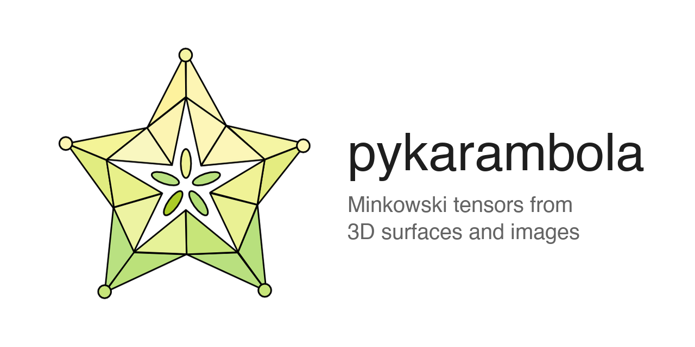

# pykarambola
<!-- CI badge disabled: GitHub Actions disabled at org level -->
<!-- [](https://github.com/Ishihara-SynthMorph/pykarambola/actions/workflows/ci.yml) -->
[](https://pypi.org/project/pykarambola/)
[](https://pypi.org/project/pykarambola/)
[](https://www.gnu.org/licenses/gpl-3.0)
<p align="center">
  
</p>

**pykarambola** computes Minkowski tensors for 3D objects represented as triangulated meshes — a family of shape descriptors rooted in integral geometry that rigorously quantify size, shape, and orientation.
Given a mesh, it returns scalar, vector, and tensor quantities including volume, surface area, integrated mean curvature, and Euler characteristic (the Minkowski functionals), as well as higher-rank tensors that capture anisotropy and preferred orientation independently of coordinate frame.
pykarambola is a Python implementation of [karambola](https://github.com/morphometry/karambola), the reference C++ package for Minkowski tensor computation on 3D triangulated surfaces.
Minkowski tensors are widely applicable to analyzing 3D structures in biomedical imaging, computational physics, and materials science.

## New in pykarambola

Compared to the original C++ karambola, this Python port adds:

- **OBJ and GLB parsers** — read Wavefront OBJ and binary glTF (`.glb`) meshes directly, in addition to the original `.poly` and `.off` formats.
- **High-level API** — `minkowski_tensors()` accepts NumPy arrays and returns a plain dict, making it easy to integrate into pipelines without dealing with the lower-level triangulation types.
- **`labels='auto'`** — pass `labels='auto'` to detect connected mesh components automatically and compute tensors for each body separately, without supplying a face-label array.
- **`return_count=True`** — append the number of connected objects to the return value as a `(results, n_objects)` tuple.
- **Derived scalar quantities** — each rank-2 tensor (e.g. `w020`) additionally yields `{name}_beta` (anisotropy index: ratio of smallest to largest eigenvalue magnitude), `{name}_trace` (matrix trace), and `{name}_trace_ratio` (trace divided by the corresponding Minkowski scalar, e.g. `w020_trace_ratio = Tr(w020) / w000`).
  These are pykarambola-specific extensions not present in C++ karambola; they are included in the `compute='all'` preset.
- **Label-image API** — `minkowski_tensors_from_label_image()` extracts surfaces from a 3D integer label image via marching cubes and computes tensors for every label in one call.

## Requirements

- Python ≥ 3.9
- [NumPy](https://numpy.org/)
- [SciPy](https://scipy.org/)

**Optional:**
- [Cython](https://cython.org/) ≥ 3.0 — compiled C acceleration (`pip install "pykarambola[accel]"`)
- [scikit-image](https://scikit-image.org/) — label-image API (`pip install "pykarambola[dev]"`)
- [trimesh](https://trimesh.org/) — GLB/glTF file support (`pip install "pykarambola[glb]"`)

## Installation

```bash
pip install pykarambola
```

For optional Cython acceleration:

```bash
pip install "pykarambola[accel]"
```

For development (includes pytest and scikit-image):

```bash
pip install "pykarambola[dev]"
```

GLB/glTF support requires [trimesh](https://trimesh.org/):

```bash
pip install "pykarambola[glb]"
```

## High-level API

### From NumPy arrays

`minkowski_tensors()` is the main entry point. Pass vertices and faces as NumPy arrays and get back a plain dict:

```python
import pykarambola as pk

result = pk.minkowski_tensors(
    verts,   # (V, 3) float64 array of vertex positions
    faces,   # (F, 3) int64 array of vertex indices
)

print(result["w000"])   # volume
print(result["w100"])   # surface area
print(result["w200"])   # integrated mean curvature
print(result["w300"])   # Euler characteristic
print(result["w020"])   # 3×3 Minkowski tensor
print(result["w020_eigvals"])   # eigenvalues of w020
print(result["w020_eigvecs"])   # eigenvectors of w020 (columns)
```

Control which quantities are computed with the `compute` argument:

```python
# default: 14 standard tensors + eigensystems for rank-2 tensors
result = pk.minkowski_tensors(verts, faces, compute="standard")

# include higher-order tensors (w103, w104) and spherical Minkowski metrics
result = pk.minkowski_tensors(verts, faces, compute="all")

# compute only specific quantities
result = pk.minkowski_tensors(verts, faces, compute=["w000", "w100", "w020"])
```

If the mesh has boundary edges (open surface), `w000` and `w020` are set to `NaN` and a `UserWarning` is emitted. Non-manifold meshes also emit a `UserWarning` but are otherwise computed.

### From a 3D label image

`minkowski_tensors_from_label_image()` takes a 3D integer array, runs marching cubes on each label, and returns a dict of results keyed by label value. Requires [scikit-image](https://scikit-image.org/).

```python
import numpy as np
import pykarambola as pk

label_image = np.zeros((64, 64, 64), dtype=int)
label_image[10:40, 10:40, 10:40] = 1
label_image[40:60, 40:60, 40:60] = 2

result = pk.minkowski_tensors_from_label_image(
    label_image,
    spacing=(0.5, 0.5, 0.5),   # voxel size in physical units
    center="centroid_mesh",     # shift tensors to per-label centroid
)

print(result[1]["w000"])   # volume of label 1
print(result[2]["w100"])   # surface area of label 2
```

By default a 1-voxel zero border is added before running marching cubes (`pad=True`), so objects touching the array boundary produce closed surfaces. Pass `pad=False` to skip this.

The `center` argument controls the reference point for position-dependent tensors:

| Value | Behaviour |
|-------|-----------|
| `None` (default for mesh API) | Use the array origin `(0, 0, 0)` |
| `'centroid_mesh'` (default for label-image API) | Shift each object to its volume-weighted centre of mass |
| `'centroid_voxel'` | Use the mean voxel coordinate (label-image API only) |
| `'reference_centroid'` | Reproduce the C++ karambola `--reference_centroid` flag |
| `(3,)` array | Apply an explicit fixed shift |

### Multi-label meshes

Pass per-face integer labels to compute tensors for multiple bodies in a single mesh:

```python
result = pk.minkowski_tensors(verts, faces, labels=face_labels)
# result is dict[int, dict]
print(result[1]["w000"])
print(result[2]["w000"])
```

Or let pykarambola detect connected components automatically:

```python
result = pk.minkowski_tensors(verts, faces, labels="auto")
# bodies are numbered 1, 2, … by connected component
print(result[1]["w000"])
```

## File I/O

pykarambola can read four mesh formats. The parsers return a `Triangulation` object that can be passed directly to `minkowski_tensors()`.

```python
surface = pk.parse_poly_file("my_surface.poly")   # karambola native
surface = pk.parse_off_file("my_surface.off")     # Object File Format
surface = pk.parse_obj_file("my_surface.obj")     # Wavefront OBJ  (new)
surface = pk.parse_glb_file("my_surface.glb")     # binary glTF    (new, requires trimesh)

result = pk.minkowski_tensors(surface)
```

| Extension | Description |
|-----------|-------------|
| `.poly`   | karambola native format |
| `.off`    | Object File Format |
| `.obj`    | Wavefront OBJ |
| `.glb`    | GL Transmission Format (binary glTF) — requires `trimesh` |

## Command-line interface

```
python -m pykarambola [options] <surface_file>
```

Supported input formats: `.poly`, `.off`, `.obj`, `.glb`.
Run `python -m pykarambola --help` for the full list of options.

## Computed quantities

All quantities below are returned by `compute='standard'` unless noted `(compute='all')`.

| Name | Type | Description |
|------|------|-------------|
| `w000` | scalar | Volume |
| `w100` | scalar | Surface area |
| `w200` | scalar | Integrated mean curvature |
| `w300` | scalar | Euler characteristic |
| `w010` | vector | Minkowski vector (volume) |
| `w110` | vector | Minkowski vector (surface) |
| `w210` | vector | Minkowski vector (curvature) |
| `w310` | vector | Minkowski vector (topology) |
| `w020` | rank-2 tensor | Minkowski tensor (volume) |
| `w120` | rank-2 tensor | Minkowski tensor (surface) |
| `w220` | rank-2 tensor | Minkowski tensor (curvature) |
| `w320` | rank-2 tensor | Minkowski tensor (topology) |
| `w102` | rank-2 tensor | Minkowski tensor (surface, normal-normal) |
| `w202` | rank-2 tensor | Minkowski tensor (curvature, normal-normal) |
| `w103` | rank-3 tensor | Higher-order tensor (`compute='all'`) |
| `w104` | rank-4 tensor | Higher-order tensor (`compute='all'`) |
| `msm_ql`, `msm_wl` | arrays | Minkowski structure metrics (spherical, `compute='all'`) |
| `{name}_beta` | scalar | Anisotropy index: min\|λ\| / max\|λ\| for each rank-2 tensor (`compute='all'`) |
| `{name}_trace` | scalar | Trace of each rank-2 tensor matrix (`compute='all'`) |
| `{name}_trace_ratio` | scalar | Trace divided by corresponding Minkowski scalar, e.g. `Tr(w020)/w000` (wX20 family only; `compute='all'`) |

Rank-2 tensors additionally yield `{name}_eigvals` and `{name}_eigvecs` entries.

## Citation

If you use pykarambola in published work, please cite both pykarambola and the original karambola package.

> Ishihara, K., & Khurana, Y.
> *pykarambola: Minkowski tensor morphometry of 3D structures* (v0.3.0).
> https://doi.org/10.5281/zenodo.XXXXXXX

> Schaller, F. M., Kapfer, S. C., & Schröder-Turk, G. E.
> *karambola — 3D Minkowski Tensor Package* (v2.0).
> https://github.com/morphometry/karambola

## Contributing

See [`CONTRIBUTING.md`](CONTRIBUTING.md) for development setup, Git workflow, versioning, and release instructions.
See [`CHANGELOG.md`](CHANGELOG.md) for a history of changes between versions.

## License

See [`LICENSE`](LICENSE).
