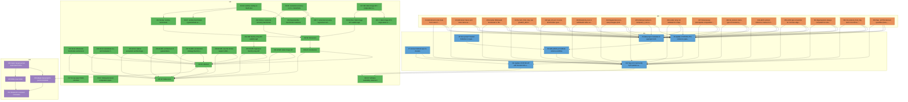

# Issue Dependency Tree

```mermaid
flowchart TD
    subgraph M0["M0"]
        N1["#1 Add derived scalar beta from rank-2 t..."]
        N2["#2 Add tensor traces and trace ratios as..."]
        N3["#3 Rename 'Minkowski functionals' to 'Mi..."]
        N4["#4 mk_func_from_img: use gradient_direct..."]
        N42["#42 get_ref_vec: no zero-denominator guar..."]
        N43["#43 Division by zero in w300/w320 when ve..."]
        N44["#44 Degenerate (zero-area) triangles prod..."]
        N45["#45 Unknown names in compute=[...] are si..."]
        N46["#46 center array not validated for shape"]
        N47["#47 Unnecessary prerequisite computation ..."]
        N48["#48 mk_tensors return-type inconsistency ..."]
        N49["#49 w320 centroid reference crashes for t..."]
        N50["#50 w202 sign convention for concave edge..."]
        N51["#51 Eigensystems always computed for rank..."]
        N52["#52 mk_tensors_from_img does not enforce ..."]
        N53["#53 New _EXTRA derived quantities (beta, ..."]
    end
    subgraph M1["M1"]
        N5["#5 Update CITATION.cff to reference pyka..."]
        N6["#6 Add project metadata to pyproject.toml"]
        N7["#7 Connect GitHub repo to Zenodo"]
        N8["#8 Set up PyPI Trusted Publisher on pypi..."]
        N9["#9 Add publish.yml GitHub Actions workflow"]
        N10["#10 Tag v1.0.0 and verify PyPI publish su..."]
        N11["#11 Update CITATION.cff with Zenodo DOI a..."]
    end
    subgraph M2["M2"]
        N12["#12 Set up paper folder structure"]
        N13["#13 B: runtime scaling vs mesh size"]
        N14["#14 B: numerical accuracy vs C++ karambola"]
        N15["#15 Reproducible benchmark notebook"]
        N16["#16 NB: NumPy array API walkthrough"]
        N17["#17 NB: label-image API / single-label vs..."]
        N18["#18 F: Minkowski tensor computation pipel..."]
        N19["#19 F: runtime benchmark / pykarambola vs..."]
        N20["#20 F: numerical accuracy / agreement wit..."]
        N21["#21 F: label-image API / single-label vs ..."]
        N22["#22 W: Abstract"]
        N23["#23 W-Int: Minkowski functionals and tensors"]
        N24["#24 W-Int: karambola C++ and motivation f..."]
        N25["#25 W-Int: Python ecosystem and bioimage ..."]
        N26["#26 W-Mth: architecture of pykarambola"]
        N27["#27 W-Mth: acceleration strategy (NumPy v..."]
        N28["#28 W-Mth: new file format support (OBJ, ..."]
        N29["#29 W-Mth: high-level NumPy array API"]
        N30["#30 W-Mth: label-image API"]
        N31["#31 W-Res: runtime benchmark"]
        N32["#32 W-Res: numerical accuracy benchmark"]
        N33["#33 W-Res: label-image API walkthrough"]
        N34["#34 W: Discussion"]
        N35["#35 W: Conclusions"]
        N36["#36 W: Software availability statement"]
        N37["#37 W: References"]
    end
    subgraph M3["M3"]
        N38["#38 Select target journal and check forma..."]
        N39["#39 Adapt manuscript to journal template"]
        N40["#40 Write cover letter"]
        N41["#41 Respond to reviewer comments"]
    end

    N53 --> N5
    N53 --> N6
    N53 --> N10
    N52 --> N5
    N52 --> N6
    N52 --> N10
    N51 --> N5
    N51 --> N6
    N51 --> N10
    N50 --> N5
    N50 --> N6
    N50 --> N10
    N49 --> N5
    N49 --> N6
    N49 --> N10
    N48 --> N5
    N48 --> N6
    N48 --> N10
    N47 --> N5
    N47 --> N6
    N47 --> N10
    N46 --> N5
    N46 --> N6
    N46 --> N10
    N45 --> N5
    N45 --> N6
    N45 --> N10
    N44 --> N5
    N44 --> N6
    N44 --> N10
    N43 --> N5
    N43 --> N6
    N43 --> N10
    N42 --> N5
    N42 --> N6
    N42 --> N10
    N40 --> N41
    N39 --> N41
    N38 --> N39
    N38 --> N40
    N35 --> N22
    N35 --> N37
    N34 --> N35
    N33 --> N34
    N32 --> N34
    N31 --> N34
    N30 --> N22
    N30 --> N37
    N29 --> N22
    N29 --> N37
    N28 --> N22
    N28 --> N37
    N27 --> N22
    N27 --> N37
    N26 --> N22
    N26 --> N37
    N25 --> N22
    N25 --> N37
    N24 --> N22
    N24 --> N37
    N23 --> N22
    N23 --> N37
    N22 --> N37
    N22 --> N39
    N17 --> N21
    N17 --> N33
    N16 --> N29
    N14 --> N15
    N14 --> N20
    N14 --> N32
    N13 --> N15
    N13 --> N19
    N13 --> N31
    N11 --> N36
    N10 --> N36
    N9 --> N10
    N8 --> N9
    N7 --> N10
    N7 --> N11
    N6 --> N9
    N5 --> N11
    N4 --> N5
    N4 --> N6
    N4 --> N10
    N3 --> N5
    N3 --> N6
    N3 --> N10
    N2 --> N5
    N2 --> N6
    N2 --> N10
    N1 --> N5
    N1 --> N6
    N1 --> N10

    classDef m0 fill:#e8905a,stroke:#c0603a,color:#111
    classDef m1 fill:#5a9fd4,stroke:#3a7fb4,color:#111
    classDef m2 fill:#5ab55a,stroke:#3a953a,color:#111
    classDef m3 fill:#9a7fc0,stroke:#7a5fa0,color:#fff
    class N1,N2,N3,N4,N42,N43,N44,N45,N46,N47,N48,N49,N50,N51,N52,N53 m0
    class N5,N6,N7,N8,N9,N10,N11 m1
    class N12,N13,N14,N15,N16,N17,N18,N19,N20,N21,N22,N23,N24,N25,N26,N27,N28,N29,N30,N31,N32,N33,N34,N35,N36,N37 m2
    class N38,N39,N40,N41 m3
```
